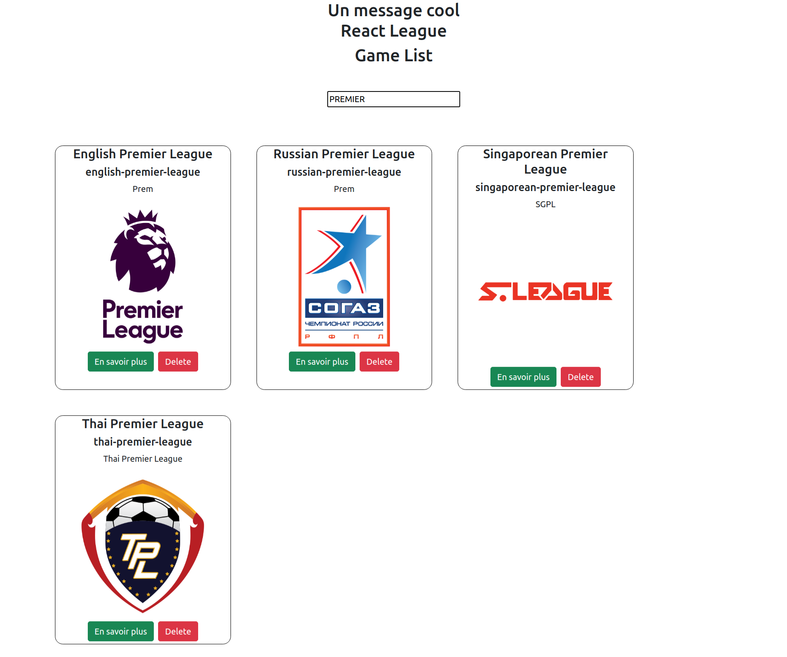

# REACT SOCCER - CHECKPOINT 2
## Disclaimer

The checkpoint is quite consequent, it's no big deal if you don't do everything before the deadline. Do your best, and most importantly **HAVE FUN** :smiley:

# The checkpoint itself :fire:

## :zero: Setup
clone the project and run npm install

## :one: React

**In this step, you will create a web-app using React, that displays Leagues from one of our API !**

_Please please, don't forget to make atomic commits with explicit messages_ :pray:

You can find the API documentation there :

- https://github.com/azharimm/football-standings-api

### Starting point

- You can wipe all the boilerplate jsx code in `App.jsx`
- Then, create a `<Header />` component that displays a cool welcome message.
- Pass a `name` prop to this component, to display your website name (_react soccer_ if you don't have any idea)

_commit_ 

### Some list ?

- Your next mission is to display the full list of Leagues.
- Start by creating two new components `<Leagues />` and `<League />`.
- In the `<Leagues />` component, you will need to get the list from the API, and map it in your jsx. For each league you get from the API, display a `<League />` component.
- Your `<League />` component will need some props to display the league informations. There are plenty of informations you can use (_name, slug, logos, ..._). Display them in the format of your choice !

_commit_ 

### Filtering

- Now that you are displaying all leagues, your next mission is to add a filter on this list.
- Add an `Input` and a `button` to the `<Leagues />` component, when you click on the `button`, it will filter the leagues that contains the letter in the fields in its name.

_again, don't forget to commit_ :wink:

### Details page

You are going to use `react-router` and `react-router-dom`

- Refactor your code to implement a router, with two routes :
  - `"/"` will display your `<Leagues />`
  - `"/leagues/:id"` will display the next component you are going to create
- Create a `<LeagueDetail/>` component, and use it in your `/leagues/:id` route.
- Then, you can add a navigation link (or button) to your `<League/>` component that will redirect to the details page of this league.
- The `<LeagueDetail />` component will need to fetch data from the API and display detailed information about the current league (what you choose to display is up to you !) from the route params

_you know what to do, right ?_ :wink:

- - -
### Congrats ! You did it ! :confetti_ball:

## Bonuses

If you have remaining time, here are some bonuses. As they are bonuses, they are **totally optional**, and you shouldn't do them if you haven't finished the previous steps.

### Removing a League

`<League />` contains a `<button>` which allows you to remove a league from the list _(doesn't need to remove it in the API)_.

### Refactor your API calls

You can try to refactor your API calls using  with service and pass the request with async/await feature.:wink:

### Use a CSS framework

Integrate the CSS framework of your choice in your React App. 
If you don't know which one to choose, we can recommand Tailwind.

You can start by looking at the documentation about [how to install it](https://tailwindcss.com/docs/installation).

**Be careful !** :warning: If you choose to start using `create-react-app`, you will need to install CRACO, but every steps [are explained here](https://tailwindcss.com/docs/guides/create-react-app).

